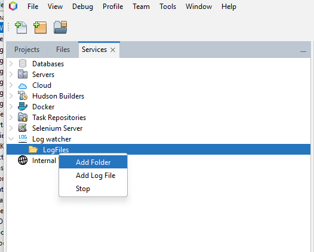

NetBeans Log Watcher
=======================

This module provides a tool to monitor log changes in the Output tab.
This acts similar like a linux `tail -f` done in a log folder.

Compatibility
-------------

* NetBeans version 12.2+
* Java version 1.8+

Installation
------------

### Manually

First, download the latest NBM package.  
Then proceed through the menu _Tools > Plugins > Downloaded > Add Plugins..._

### Apache NetBeans Plugin Portal Update Center

Go to _Tools > Plugins > Available Plugins_, check _NetBeans Case Converter_ in the _Editing_ section, then click the _Install_ button.

Usage
-----

### Add a folder

1. Open the Services window (Window > Services)
2. Click on the Log Watcher icon
3. Right click -> Click on Add folder
4. Select a folder and click OK

### Add a file

1. Open the Services window (Window > Services)
2. Click on the Log Watcher icon
3. Right click -> Click on Add a log file
4. Select a the file and click OK

### Start watching

- Right click on a folder and select `Watch`

### Features

- Filter files to watch for changes
- Mark folders which don't exist anymore as broken
- Colored output for lines which contain exception
- Stop watch
- Clear log output
- Open folders and file in the host filesystem

### Known issues

- The add folder takes some time. This is a issue with the swing **JFileChooser** library
- Jtree not working properly on older netbeans versions < 18